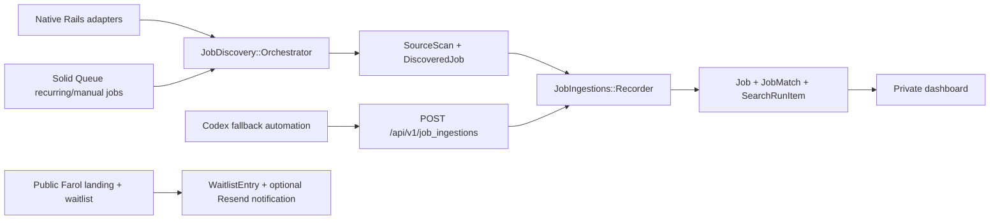

# Architecture

`job-search-dashboard` is a Rails 8 application for a private operator-facing job radar with a public Farol landing. Rails owns canonical job persistence, profile-specific matching, source operations, and the trust boundary for every imported vacancy. Codex is not the primary runtime. It is a narrow fallback client for sources Rails explicitly marks as blocked or assisted.

The core pipeline is intentionally shared at the write boundary:

## Trust Boundary

The most important architecture choice is that Rails revalidates every job before it becomes canonical:

- native adapters emit normalized candidates into `SourceScan` and `DiscoveredJob`;
- Codex fallback posts raw results into `POST /api/v1/job_ingestions`;
- both paths converge in `JobIngestions::Recorder`;
- `JobMatching::ProfileMatcher` and `JobDiscovery::Policy` decide the final accepted profiles and match strength;
- `JobMatches::Upserter` keeps the per-profile write path canonical.

That means external payloads can suggest `reason`, `score`, `stack_tags`, or `match_strength`, but they do not own final state.

The request-level proof for the rejection side of that boundary lives in
`test/controllers/api/v1/job_ingestions_controller_test.rb`, while
`test/services/job_ingestions/importer_test.rb` locks the same malformed-payload contract one layer lower.

## Discovery Boundary

Native discovery is Rails-owned and operationally explicit:

- `JobSource` stores which sources are enabled, backfillable, or Codex-fallback-only.
- `JobDiscovery::Registry` limits the allowed adapter surface.
- `JobDiscovery::Fetcher` owns HTTP politeness and resilience.
- `JobDiscovery::Orchestrator` creates one `SearchRun`, one `SourceScan` per source, and one `DiscoveredJob` per candidate before any canonical write.
- `config/recurring.yml` schedules the daily native run; `SearchRunsController` and `dashboard:discover` provide manual entrypoints.

This keeps source coverage observable instead of hiding it inside background scraper scripts.

## Matching Boundary

The domain is intentionally split into three layers:

- `Job` is the canonical vacancy, deduped by fingerprint and canonical URL.
- `SearchProfile` is one operator's search intent: stacks, titles, seniority, remote/locality, and women-only eligibility preference.
- `JobMatch` is the per-profile decision and workflow state for one canonical job.

This avoids the common trap of treating "job feed" and "job fit" as the same record.

## Operational Boundary

The product exposes the operational truth needed to run the system:

- `SearchRun` and `SearchRunItem` show import/update/reject outcomes;
- `SourceScan` shows per-source scan status and coverage counters;
- `DiscoveredJob` preserves pre-ingestion evidence for audits and debugging;
- `SourcesController` lets the operator edit adapter settings, enable backfill, and mark Codex fallback reasons;
- `SearchRunsController` can enqueue a full run or a source-scoped run.

The source catalog is part of the product, not just a seed script.

## Web And API Boundary

The app has two user-facing surfaces:

- private HTML dashboard for the operator (`Jobs`, `SearchProfiles`, `SearchRuns`, `Sources`);
- public Farol landing with a persisted waitlist capture flow.

The API surface stays narrow:

- `POST /api/v1/job_ingestions` accepts imported jobs behind `INGEST_SHARED_TOKEN`;
- `GET /api/v1/codex_fallback_sources` exposes only the sources Rails wants Codex to cover.

Everything else stays inside the Rails UI and background job flow.

## Deployment Boundary

The deployed shape is intentionally small:

- one codebase;
- one Railway image;
- one `web` role and one `worker` role via `APP_SERVICE_ROLE`;
- one PostgreSQL database backing both app data and Solid Queue tables;
- one `bin/predeploy` entrypoint that retries `db:prepare` and reseeds the source catalog/admin bootstrap safely.

This is enough to demonstrate product operations without inventing extra infrastructure.

## Reviewer Fast Path

If you want the shortest technically honest read:

1. `app/services/job_discovery/orchestrator.rb`
2. `app/services/job_ingestions/recorder.rb`
3. `app/services/job_discovery/policy.rb`
4. `app/controllers/search_runs_controller.rb`
5. `app/controllers/sources_controller.rb`
6. `test/services/job_discovery/orchestrator_test.rb`
7. `test/services/job_ingestions/importer_test.rb`
8. `test/controllers/api/v1/job_ingestions_controller_test.rb`
9. `test/controllers/sources_controller_test.rb`

## Non-Goals

- It is not a public multi-tenant recruiting SaaS.
- It does not claim full native coverage of every board in the catalog.
- It does not auto-apply to jobs.
- It does not let Codex bypass the Rails trust boundary.
